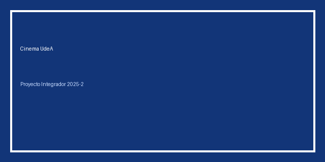

# 🎬 Cinema Universitario (cine-maxi)

## 1. Integrantes
- (Alejandro alzate cadavid) – Programa: (ingenieria industrial), habilidades:Encargado de la gestión del repositorio y coordinación del equipo (…)

## 2. Vínculos académicos y descripción
Este proyecto pertenece al curso Algoritmia y Programación.

Habilidades del grupo
Lógica y razonamiento algorítmico
Programación estructurada
Manejo de estructuras de datos
Resolución de problemas
Depuración y pruebas
Trabajo colaborativo con Git/GitHub
Fortalezas del grupo
Adaptabilidad
Comunicación efectiva
Organización y planificación
Creatividad en la solución de problemas
Compromiso y responsabilidad

## 3. Nombre del proyecto y detalles
Nombre del proyecto: Cine-Maxi
Descripción breve:
Cine-Maxi es una aplicación para gestionar el servicio de cine universitario en la Universidad de Antioquia, permitiendo registro de usuarios, reservas, administración de ingresos y generación de reportes.

## 4. Licencia del software
Este repositorio usa **MIT License** por ser software; si tu docente requiere **Creative Commons** (indicado en el enunciado), documenta la elección en `doc/licencia.md`.

## 5. Reporte de visión
Consulta `doc/vision.md`.

## 6. Especificación de requisitos
Consulta `requisitos/funcionales.md` y `requisitos/no_funcionales.md`.

## 7. Plan de proyecto
Consulta `gestion/plan_proyecto.md` (incluye diagrama de Gantt y presupuesto en horas/SMLV).

## 8. Plan de versionado
Consulta `gestion/versionado.md`.

## 9. Algoritmo (código)
Código fuente dentro de `src/`:
- `Cinema_UdeA.ipynb` (Google Colab)
- `cinema_udea.py` (script Python ejecutable en local)

## 10. Manual de usuario
Consulta `doc/manual_usuario.md`.

### Exportación CSV
El sistema genera `datos/usuarios.csv`, `datos/reservas.csv`, `datos/ventas.csv`.

### Credenciales Admin
Usuario: `admin` • Clave: `admin123` (modifica en `cinema_udea.py`).

