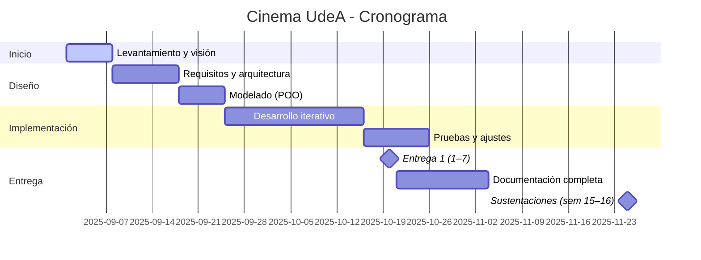

# Plan de Proyecto

## Cronograma (Mermaid Gantt)

> Las fechas son referenciales; ajusta según tu calendario real de 2025-2.

## Presupuesto (en horas de práctica)
- Equipo: **3 estudiantes** × **50 horas** cada uno = **150 horas**.
- Valor de práctica: **1 SMLV** (no se paga dinero, se reconoce en tiempo de formación).

## Riesgos y mitigación
- Cambios en el listado de películas → parametrización en `configurar_funciones_ejemplo()`.
- Fallos por entradas inválidas → validaciones y mensajes claros.
